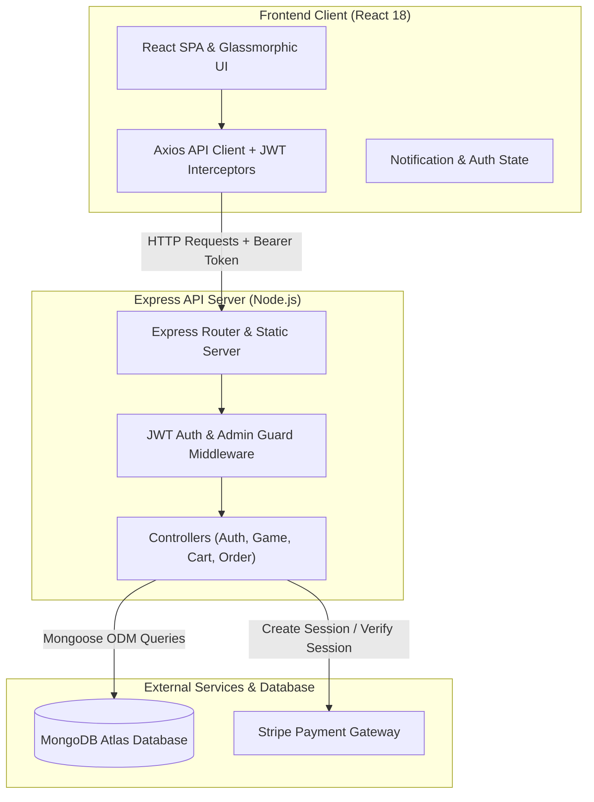
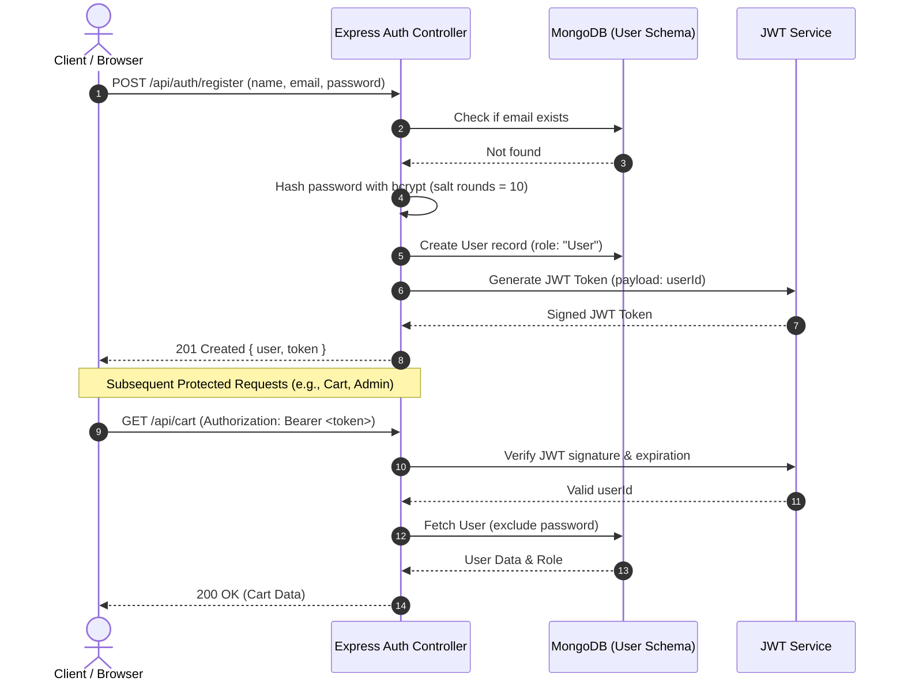
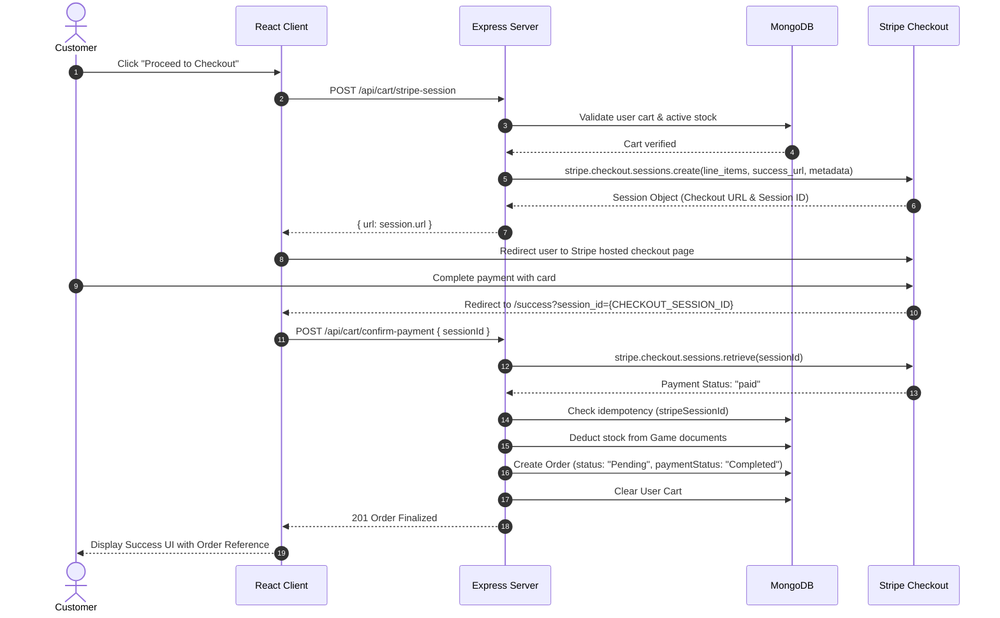
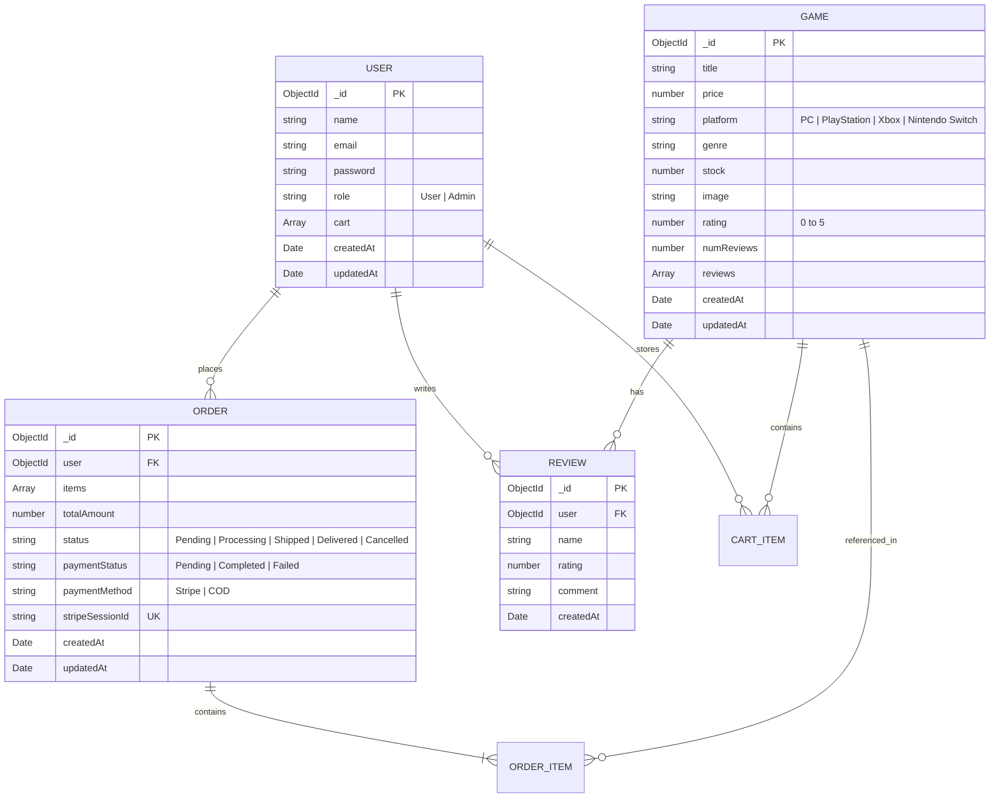

# 🎮 Gaming Store — Full-Stack E-Commerce Platform

[](https://nodejs.org/)
[](https://reactjs.org/)
[](https://expressjs.com/)
[](https://www.mongodb.com/)
[](https://stripe.com/)
[](https://www.framer.com/motion/)
[](LICENSE)

A modern, high-performance, full-stack digital video game store built on the **MERN** stack (MongoDB, Express, React, Node.js). Features a cyber-dark glassmorphic UI, real-time inventory management, Stripe payment processing, user ratings & reviews, and a dedicated role-based Admin Management Dashboard.

---

## 📑 Table of Contents

- [Key Features](#-key-features)
- [System Architecture](#-system-architecture)
- [Workflow Diagrams](#-workflow-diagrams)
  - [1. User Authentication & Authorization Flow](#1-user-authentication--authorization-flow)
  - [2. Shopping Cart & Stripe Checkout Lifecycle](#2-shopping-cart--stripe-checkout-lifecycle)
  - [3. Entity-Relationship (ER) Schema](#3-entity-relationship-er-schema)
- [Tech Stack](#-tech-stack)
- [Project Structure](#-project-structure)
- [API Reference](#-api-reference)
  - [Authentication](#authentication-endpoints)
  - [Games & Reviews](#games--reviews-endpoints)
  - [Cart & Checkout](#cart--checkout-endpoints)
  - [Orders](#orders-endpoints)
  - [System Health](#system-health)
- [Getting Started](#-getting-started)
  - [Prerequisites](#prerequisites)
  - [Clone Repository](#clone-repository)
  - [Environment Variables](#environment-variables)
  - [Database Seeding](#database-seeding)
  - [Running Locally](#running-locally)
  - [Production Build & Deployment](#production-build--deployment)
- [Contributing](#-contributing)
- [License](#-license)

---

## ✨ Key Features

### 🛒 Customer Experience
- **Interactive Game Catalog**: Browse games across multiple platforms (*PC, PlayStation, Xbox, Nintendo Switch*) and genres (*Action, RPG, FPS, Strategy, etc.*).
- **Search, Filter & Sort**: Real-time debounced title search, genre and platform filters, customizable price brackets, and multi-criteria sorting (Price, Newest, Top Rated).
- **Persistent Cart & Inventory Sync**: Server-synchronized cart with live stock deduction checks to prevent overselling.
- **Ratings & Reviews**: Authenticated users can leave star ratings (1-5★) and written feedback. Ratings dynamically recalculate overall game scores.
- **Stripe Checkout Integration**: Seamless card checkout via Stripe Checkout Sessions with instant stock confirmation and order generation.
- **Order History**: Personal transaction ledger displaying line items, fulfillment status badges, timestamps, and total spend.
- **Cyberpunk / Glassmorphic UI**: Dynamic neon accents, glassmorphic cards, smooth micro-interactions via `framer-motion`, and custom toast alerts.

### 🛡️ Administrative Control Center
- **Role-Based Access Control (RBAC)**: Secure access restricted to users with `role: "Admin"`.
- **Game Catalog CRUD**: Create new game listings, modify price/stock/details/images, and remove titles.
- **Order & Fulfillment Management**: Inspect customer orders, line items, payment status, and update shipment signals (*Pending*, *Processing*, *Shipped*, *Delivered*, *Cancelled*).

---

## 🏗 System Architecture



---

## 🔄 Workflow Diagrams

### 1. User Authentication & Authorization Flow



---

### 2. Shopping Cart & Stripe Checkout Lifecycle



---

### 3. Entity-Relationship (ER) Schema



---

## 💻 Tech Stack

| Domain | Technology | Purpose |
|---|---|---|
| **Frontend UI** | [React 18](https://reactjs.org/) | Single-page application UI rendering |
| **Routing** | [React Router v6](https://reactrouter.com/) | Declarative client-side routing & route guards |
| **Animations** | [Framer Motion](https://www.framer.com/motion/) | UI micro-interactions, page transitions, and modals |
| **HTTP Client** | [Axios](https://axios-http.com/) | REST API requests with request/response interceptors |
| **Styling** | Vanilla CSS3 (Custom Design System) | Cyber-dark glassmorphism, responsive grid & flex layouts |
| **Backend Runtime** | [Node.js](https://nodejs.org/) & [Express 5](https://expressjs.com/) | RESTful API server, routing, and static file hosting |
| **Database & ODM** | [MongoDB Atlas](https://www.mongodb.com/) & [Mongoose 8](https://mongoosejs.com/) | Schema-based document persistence & relationships |
| **Authentication** | [JSON Web Tokens (JWT)](https://jwt.io/) & [bcryptjs](https://www.npmjs.com/package/bcryptjs) | Stateless auth tokens and password hashing |
| **Payments** | [Stripe SDK](https://stripe.com/) | Secure checkout sessions and payment verification |

---

## 📁 Project Structure

```
Gaming-Store/
├── backend/
│   ├── src/
│   │   ├── controllers/
│   │   │   ├── auth.controller.js      # Register and login controllers
│   │   │   ├── cart.controller.js      # Cart CRUD, checkout, and Stripe flows
│   │   │   ├── game.controller.js      # Game listing, search/filter, and reviews
│   │   │   └── order.controller.js     # User order placement and Admin management
│   │   ├── middlewares/
│   │   │   └── auth.middleware.js     # JWT token verification and Admin gatekeeper
│   │   ├── models/
│   │   │   ├── game.model.js           # Game and sub-document Review schemas
│   │   │   ├── order.model.js          # Order schema with payment tracking
│   │   │   └── user.model.js           # User schema with embedded cart
│   │   ├── routes/
│   │   │   ├── auth.route.js           # Auth route definitions
│   │   │   ├── cart.route.js           # Cart & Stripe payment routes
│   │   │   ├── game.route.js           # Game catalog & review routes
│   │   │   └── order.route.js          # Order processing routes
│   │   └── utils/
│   │       └── generateToken.js        # JWT generation utility
│   ├── games.json                      # Seed dataset containing sample video games
│   ├── seed.js                         # Database seeding script
│   ├── server.js                       # Express app entry point & static server
│   ├── package.json                    # Backend dependencies & scripts
│   └── .env                            # Backend environment configuration
│
├── frontend/
│   ├── public/
│   │   ├── assets/                     # Public icons and illustration graphics
│   │   └── index.html                  # HTML5 entry template
│   ├── src/
│   │   ├── api/
│   │   │   ├── apiClient.js            # Axios client with auth interceptors
│   │   │   ├── authService.js          # Authentication API helpers
│   │   │   ├── cartService.js          # Cart and checkout API helpers
│   │   │   ├── gameService.js          # Game catalog and review API helpers
│   │   │   ├── orderService.js         # Order management API helpers
│   │   │   └── index.js                # Aggregated service exports
│   │   ├── components/
│   │   │   ├── AdminDashboard.jsx      # Admin panel for games & order logs
│   │   │   ├── Cart.jsx                # Shopping cart view with quantity adjustment
│   │   │   ├── GameList.jsx            # Game discovery catalog with filters
│   │   │   ├── Login.jsx               # User sign-in view
│   │   │   ├── Register.jsx            # User registration view
│   │   │   ├── MyOrders.jsx            # Order history and receipt view
│   │   │   ├── Navbar.jsx              # Responsive header navigation
│   │   │   ├── Notification.jsx        # Floating toast notification component
│   │   │   ├── NotificationContext.jsx # Toast notification React context
│   │   │   ├── ProtectedRoute.jsx      # Route guard for Authenticated / Admin users
│   │   │   ├── ReviewModal.jsx         # Modal for rating submission and feedback
│   │   │   ├── Success.jsx             # Post-checkout payment confirmation view
│   │   │   ├── Cancel.jsx              # Post-checkout cancellation view
│   │   │   └── Unauthorized.jsx        # 403 Forbidden fallback view
│   │   ├── App.js                      # Route configurations & layout shell
│   │   ├── index.css                   # Global cyberpunk theme variables and styles
│   │   └── index.js                    # React DOM entry point
│   ├── package.json                    # Frontend dependencies & scripts
│   └── .env                            # Frontend environment configuration
│
├── .gitignore
├── package.json                        # Root workspace orchestration script
└── README.md
```

---

## 📡 API Reference

### Authentication Endpoints

| Method | Endpoint | Access | Description |
|---|---|---|---|
| `POST` | `/api/auth/register` | Public | Register a new user (`name`, `email`, `password`) |
| `POST` | `/api/auth/login` | Public | Login with credentials and receive JWT |

### Games & Reviews Endpoints

| Method | Endpoint | Access | Description |
|---|---|---|---|
| `GET` | `/api/games` | Public | Get all games. Supports query params: `search`, `genre`, `platform`, `minPrice`, `maxPrice`, `sort` |
| `GET` | `/api/games/:id` | Public | Get specific game by MongoDB ObjectId |
| `POST` | `/api/games` | Admin | Create a new game entry in catalog |
| `PUT` | `/api/games/:id` | Admin | Update game details (price, stock, metadata) |
| `DELETE` | `/api/games/:id` | Admin | Remove a game from the catalog |
| `POST` | `/api/games/:id/reviews` | Private | Submit a rating (1-5) and review comment |
| `DELETE` | `/api/games/:id/reviews` | Private | Delete user's own review |

### Cart & Checkout Endpoints

| Method | Endpoint | Access | Description |
|---|---|---|---|
| `GET` | `/api/cart` | Private | Retrieve current user's shopping cart |
| `POST` | `/api/cart` | Private | Add an item to cart (`gameId`) |
| `PUT` | `/api/cart/:gameId` | Private | Update item quantity in cart (`quantity`) |
| `DELETE` | `/api/cart/:gameId` | Private | Remove an item from cart |
| `POST` | `/api/cart/checkout` | Private | Direct checkout without Stripe |
| `POST` | `/api/cart/stripe-session` | Private | Initialize Stripe Checkout session & get redirect URL |
| `POST` | `/api/cart/confirm-payment` | Private | Validate Stripe session, decrement stock, and finalize order |

### Orders Endpoints

| Method | Endpoint | Access | Description |
|---|---|---|---|
| `POST` | `/api/orders` | Private | Create a direct order (`items`, `totalAmount`, `paymentMethod`) |
| `GET` | `/api/orders/my` | Private | Retrieve logged-in user's order history |
| `GET` | `/api/orders` | Admin | Retrieve all store orders across all users |
| `PUT` | `/api/orders/:id` | Admin | Update order fulfillment status (`Pending`, `Shipped`, etc.) |

### System Health

| Method | Endpoint | Access | Description |
|---|---|---|---|
| `GET` | `/api/health` | Public | Server health probe (`{ status: "OK" }`) |

---

## 🚀 Getting Started

### Prerequisites

Make sure you have the following installed on your machine:
- [Node.js](https://nodejs.org/) (version `v18.0.0` or higher)
- [npm](https://www.npmjs.com/) (version `v9.0.0` or higher)
- A [MongoDB Atlas](https://www.mongodb.com/cloud/atlas) cluster connection URI or local MongoDB instance
- A [Stripe Developer Account](https://stripe.com/) for test API keys

---

### Clone Repository

```bash
git clone https://github.com/yashovardhan0502/Gaming-Store.git
cd Gaming-Store
```

---

### Environment Variables

#### 1. Backend Configuration
Create a `.env` file in the `backend/` directory:

```env
# backend/.env
PORT=5000
MONGODB_URI=mongodb+srv://<username>:<password>@cluster0.mongodb.net/gaming_store?retryWrites=true&w=majority
JWT_SECRET=your_jwt_secret_key_here
STRIPE_SECRET_KEY=sk_test_your_stripe_secret_key
FRONTEND_URL=http://localhost:3000
```

#### 2. Frontend Configuration
Create a `.env` file in the `frontend/` directory:

```env
# frontend/.env
REACT_APP_API_URL=http://localhost:5000/api
```

---

### Database Seeding

Populate your MongoDB database with sample video game titles (*Elden Ring, Cyberpunk 2077, God of War, etc.*):

```bash
cd backend
npm run seed
```

---

### Running Locally

You can run both backend and frontend concurrently or in separate terminals.

#### Option A: Running in separate terminals

**Terminal 1 — Backend:**
```bash
cd backend
npm install
npm start
# Server starts on http://localhost:5000
```

**Terminal 2 — Frontend:**
```bash
cd frontend
npm install
npm start
# React App starts on http://localhost:3000
```

#### Option B: Root workspace install

From the project root:
```bash
npm run install
```

---

### Production Build & Deployment

The application is structured for easy single-instance deployment (e.g., on [Render](https://render.com/), [Heroku](https://www.heroku.com/), or [Railway](https://railway.app/)):

1. **Build the Frontend:**
   ```bash
   npm run build
   ```
   *This compiles the React SPA into the `frontend/build/` directory.*

2. **Start the Production Server:**
   ```bash
   npm start
   ```
   *Express statically serves the React production bundle from `../frontend/build` while simultaneously handling all `/api/*` endpoints.*

---

## 🔒 Security Best Practices

- **Password Hashing**: User passwords are encrypted with `bcryptjs` using a salt work factor of 10 before storage.
- **Protected Routes**: Sensitive endpoints check for standard `Bearer <token>` HTTP headers.
- **Admin Verification**: Administrative actions enforce server-side validation against `req.user.role === 'Admin'`.
- **Stripe Idempotency**: Stripe session IDs are recorded uniquely on order creation to prevent duplicate charges or over-decrements.

---

## 🤝 Contributing

Contributions are welcome! If you'd like to improve the project:

1. **Fork** the repository.
2. Create a feature branch: `git checkout -b feature/EpicFeature`.
3. Commit your changes: `git commit -m "feat: Add EpicFeature"`.
4. Push to the branch: `git push origin feature/EpicFeature`.
5. Open a **Pull Request**.

---

## 📄 License

This project is licensed under the **ISC License**. See the [LICENSE](LICENSE) file for details.
